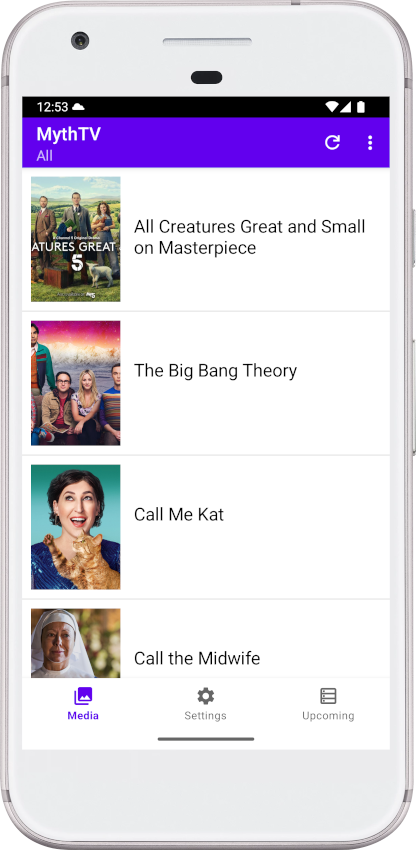
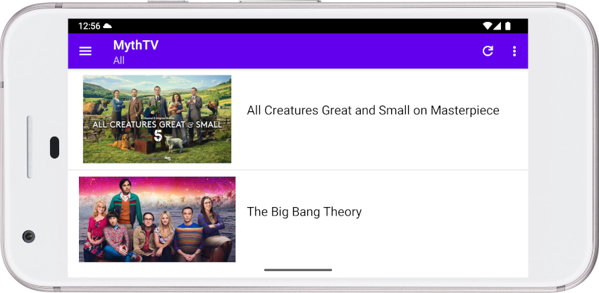
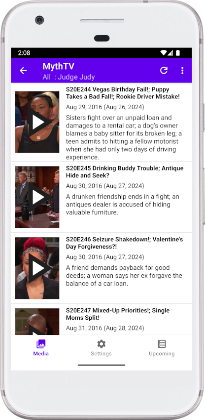
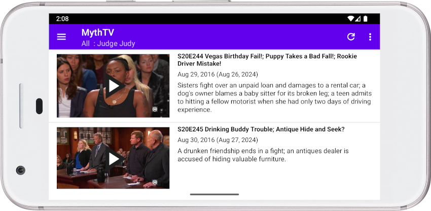
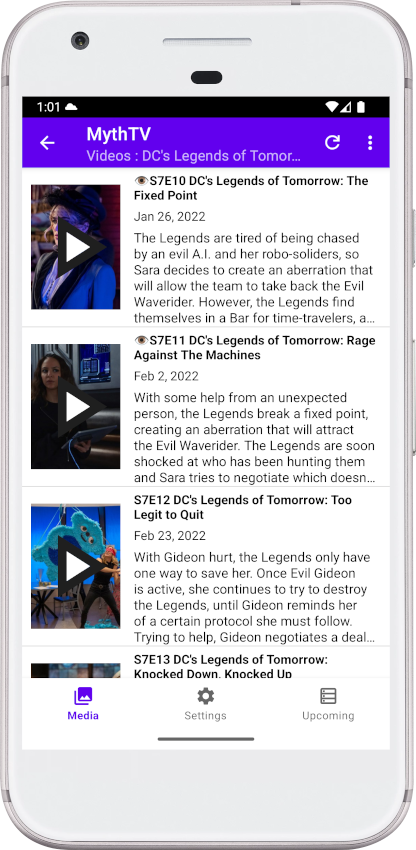
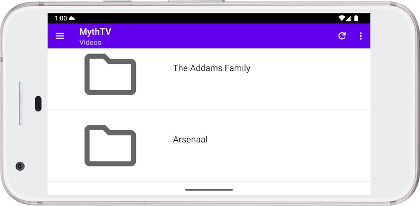
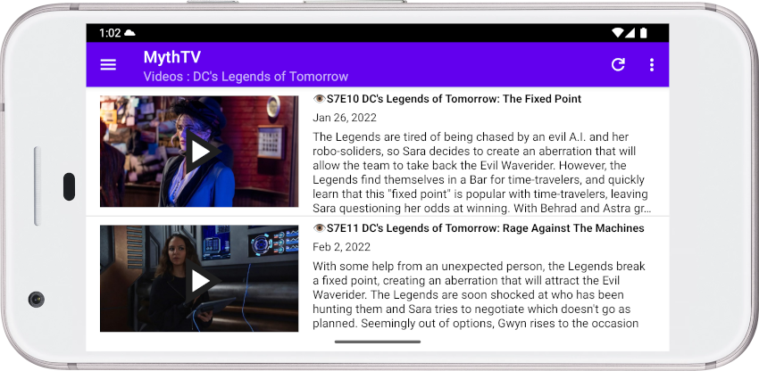
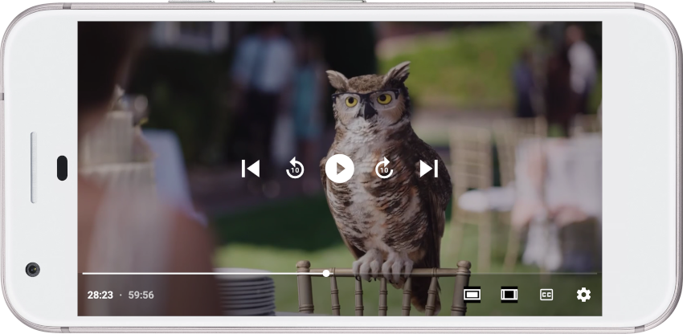
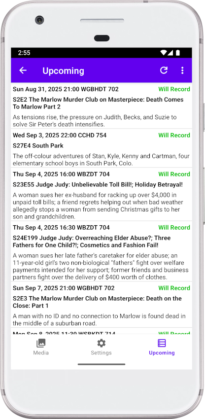

# MythTV Lean Frontend (leanfront) mobile version: Android frontend for MythTV

**For the Android TV version of leanfront see  https://github.com/bennettpeter/leanfront .**

Leanfront, mobile version, is a frontend for MythTV that runs on Android phones and tablets. Some features of the Android TV version are not yet provided in the mobile version.
Leanfront, mobile version, supports playback of recordings and videos from MythTV.

Leanfront can be installed from the [Google play store](https://play.google.com/store/apps/details?id=org.mythtv.leanfront).

Table of Contents

- [Main Screen](#main-screen)
- [Series Screen](#series-screen)
- [Videos Screen](#videos-screen)
- [Playback Screen](#playback-screen)
- [Settings](#settings)
- [Installing leanfront](#installing-leanfront)
- [Leanfront Features](#leanfront-features)
- [Release Notes](#release-notes)
- [Playback](#playback)
    - [Bookmarks and Last Play Position](#bookmarks-and-last-play-position)
    - [Commercial Break and Cut List](#commercial-break-and-cut-list)
- [Live TV](#live-tv)
- [Playback controls](#playback-controls)
- [General Operation](#general-operation)
    - [Status Port](#status-port)
    - [Mythbackend idle shutdown](#mythbackend-idle-shutdown)
    - [Refresh Lists](#refresh-lists)
- [Building](#building)
- [Internationalization](#internationalization)
- [License](#license)

## Main Screen

- The main screen shows a scrolling list for the selected recording group or All. One icon is shown per series.
- Select a group name or All from the menu obtained by tapping the &#8942; icon at the top right hand of the screen to see the [Series Screen](#series-screen).

More details

- The LiveTV group shows recordings already made from Live TV. This app does not support watching Live TV.
- If you have Videos in the Video storage group on the MythTV backend, select "Videos" from the menu of recording groups to see the [Videos Screen](#videos-screen)
- At the bottom you can select the Settings page or the Upcoming page.
- In landscape mode, tap the menu icon at top left to get to the Settings or Upcoming page.
- Indicators next to recordings show 🗑 for deleted, 👁 for Watched.

## Series Screen

- This screen shows one entry for each episode.
- Tapping an episode icon starts playback.
- Tapping the description of an episode gets a menu of actions to immediately take on the episode.

## Videos Screen
 

Videos from the Videos part of MythTV are shown here, organized by directory. You can drill down to sub-directories or play videos from this screen.

- Tapping a video icon starts playback.
- Tapping the description of a video gets a menu of actions to immediately take on the video.

## Playback Screen

- During playback tap the screen to see the playback controls. Tap again to hide them.
- Commercial skip is supported if the recording or video has been flagged in MythTV. Skipping with back and next keys is supported. Set the option to use those keys for commercial skip in [settings](#settings).
- For more information see [Playback](#playback).

## Upcoming screen

This displays upcoming recordings on the MythTV backend. You can use the menu icon at the top right hand side to select "Show All" to show the full list including shows excluded and the reason for excluding them.

## Settings

Notes

### MythTV Backend

If your backend has been set up to require user authentication for the service API, you will see user Name and Password prompts. Leanfront needs these to communicate with the backend. These do not show if you do not have a user authentication requirement, so most people will never see these prompts.

- **Maximum Recordings/Videos to load.** Leanfront can handle an unlimited number of recordings and videos. However loading huge numbers of recordings and videos results in excessively long times to load the listing. WIth 60,000 recordings it takes about 3 minutes to load he list from the backend and another 3 to 4 minutes to format the display. To avoid this, the system defaults to loading the only the most recent 10,000. If you are happy with waiting minutes for the screen to refresh, you can increase the value. If you want a quicker refresh you can reduce the value.

## Installing leanfront
You need an Android phone or tablet. For TV devices see [leanfront](https://github.com/bennettpeter/leanfront).

Leanfront is available in the [Google Play Store](https://play.google.com/store/apps/details?id=org.mythtv.leanfront). Either go to play.google.com or use the play store from the android device and search for MythTV or leanfront. If you have previously installed an apk from the download site, you do not need to uninstall, the play store will upgrade it.

### Side Load
Preferably use the play store or app store for installation.

Packages are also available here, in case you cannot install from the play store: https://drive.google.com/drive/folders/1LMf7dTK_fD_e1S3S2HgB1NEPsWI0MdyB . Make sure to download the mobile version and not the TV version.

To install a side load version you can download the apk file from the above link. Put it on your android device using direct download, a USB cable or another method. Open a file manager, select the apk file and tap on it to install. Alternatively you can use adb to install from a computer if you have developer mode enabled on the android device.

### After Installation
The first time you run the app it will prompt you for the MythTV Backend settings. Supply the IP address or DNS name of the master backend. If you have MythTV V32 or V33, change the [status port](#status-port) from 6544 to 6744. (Note that 6544 still works but does not support the latest features). In V34 and later, use port 6544. In future port 6744 may be removed.

## Leanfront Features

- The application uses exoplayer, which is the player code used by youtube, Amazon Prime and others.
- It plays recordings, videos and Live TV from a MythTV backend.
- This application uses the MythTV Service API to communicate with the backend. It needs no access to the database password, and will work on all versions of mythbackend from v29 onward. It may work on older versions if the APIs are available on the MythTV backend.
- With backend on master or recent MythTV v30 or later this frontend will prevent idle shutdown on the backend. On older backends you need to take steps to ensure the backend does not shut down while playback is occurring.
- Bookmarks are supported. Bookmarks are stored on MythTV. In order to store bookmarks for videos on MythTV you need backend version v32-Pre-658-g48557d32c2 or later or v31.0-73-g7bf1284867 or later. If you have an earlier version that does not support the Video/GetSavedBookmark and Video/SetSavedBookmark methods, the bookmarks for videos will not be set.
- Last Play Position is supported on versions of MythTV that support it. The last play position is always stored on the backend.
- The "Watched" flag is set if you get to the end of the recording or video during playback. To ensure it is set, press forward to get to the end before exiting playback.
- There is a delete/undelete option so that you can delete shows after watching. Also there set watched or unwatched and remove bookmark options.
- Videos do not currently support deletion.
- Wakeup of master backend is supported via setup.
- Subtitles (Closed captions) are supported.
- Video and Audio playback is supported using mediacodec (hardware) or ffmpeg (software). By default it will use mediacodec if it can, and will switch to ffmpeg if there is a media format not supported by mediacodec. There is a setting where you can change this default and force either mediacodec or ffmpeg.
- Selection of alternate audio tracks during playback.
- Playback from slave backends is supported.
- Playing of Live TV is not supported.
- The *Master Backend Override* MythTV setting is supported. Playback will be from the master backend even for recordings made on a slave. However the Preview image still uses the slave backend, so it will not show if the slave is down.
- Note that some phones do not support MPEG-2 playback. In this case MPEG-2 recordings are decoded via software.
- Supports MythTV commercial breaks and cut list.

## Release Notes

You can see a list of changes in each version by looking at the commit list in github. See https://github.com/bennettpeter/leanfront-mobile/commits/main .

## Playback

- Tapping the screen brings up the OSD playback controls.
- Tapping outside the controls dismisses the OSD controls.
- You can customize the Next (⏭) and Previous (⏮) buttons to either jump or skip commercials.
- You can customize the length of jumps and skips.
- If you are playing a recording that is in progress of being recorded or a LiveTV channel, playback will stop when it has played as much as was available at the start. To continue you will have to stop and resume playback. Currently the mobile version of leanfront does not fully support playback of recordings in progress.

### Bookmarks and Last Play Position

Bookmarks in a recording or video are stored in the MythTV backend. On versions of mythbackend before v32-Pre-658-g48557d32c2 or v31.0-73-g7bf1284867, video bookmarks are not supported.

Last Play Position is always set upon stopping playback and the default on starting playback is to start at Last Play Position. It can be cleared from the episode or video menu..

### Commercial Break and Cut List

If you run mythcommflag or comskip to detect commercials in a recording, or you use Edit mode in mythfrontend to add a cut list, leanfront supports skipping over cuts or commercial breaks.

There is a Setting on the Settings page, "Commercial or Cut Skip". You can select "Off", "Notify", or "Automatically Skip". These apply to both flagged commercials and cut lists. If a cut list exists the commercial breaks are ignored.

If "Off" is selected, cut lists and commercial breaks flagged are ignored, and everything plays. You can manually skip commercials if you have set previous and next keys to commercial skip.

If "Notify" is selected, when a Cut or Commercial Break is encountered, a menu is displayed at the bottom left of the screen, with options "Skip" or "Do Not Skip". If you select "Skip", playback immediately skips to the end of the cut or commercial. If you select "Do Not Skip" or leave the menu without selecting anything, it will continue playing. At any stage of playing in the cut or commercial, you can select "Skip" to go to the end.

If "Automatically Skip" is selected, playback will automatically skip each cut or commercial flagged.

In the settings there are adjustments to start and end position that can be set. Setting a negative value means that it will skip that number of seconds early, setting a positive value will skip that number of seconds late. To make sure that absolutely no commercial is shown, you can make the skip larger by setting a negative value for start adjustment and a positive value for end adjustment. However you could miss a second or two of actual show. In the opposite situation, if you are unsure whether commercial skip works correctly, you can make the skip shorter by setting a positive value in the start adjustment and a negative value in the end adjustment. Then you will see a few seconds of commercial at the start and end of the break, so that you can be sure it is only skipping commercial and not skipping part of the show.

There is currently no way to edit a recording or video in leanfront. That can only be done in mythfrontend.

Leanfront also supports skip and cut lists in Videos in the "Videos" storage group. For this you need mythbackend version v33-Pre-925-gf702d54093 or later, and you need to use the new http port (6744).

## Live TV

Live TV is not supported.

## Playback controls

The following controls are available when tapping during playback.

In the middle of the screen are icons previous, skip back, pause or play, skip forward, next. The number of seconds to skip can be selected in Settings. Previous and next can be set to jump back and forward or to skip commercials.

The progress bar near the bottom can be dragged or tapped to navigate playback to a new position.

The CC icon can be used to select a caption to display.

The cogwheel presents a menu where you can change playback speed or audio track.

To the left of the CC button is the aspect ratio button. This is for use if the picture is shown stretched due to the video having wrong aspect ratio information. It supports the resolution set by the video (default), 4x3, 16x9, and 9x16.

To the left of the aspect ratio button is the zoom button. By default the picture is shrunk until it all fits in the screen. Tapping zoom changes it so that it expands until the entire screen is filled, keeping the aspect correct, and possibly cutting off parts of the picture along the edges.

## General Operation

### Status Port

In mythbackend V32 and V33, the web server has been rewritten and there is a new status port. The old status port still works but does not support the latest features, like "Last Play Position". To use the latest features, change your port number in settings to 6744. If you have any problems with this please open a ticket.

This is a temporary change, in V34 the port changes back to 6544, with the new features. Port 6744 is still supported in V34 and is an alternative port for the same code as port 6544. At some point, 6744 may be disabled. You will then have to change your settings back to port 6544.

### Authentication

In MythTV V35, and authentication option has been added to MythTV services. See https://www.mythtv.org/wiki/Web_Application#API_and_Web_App_Authentication . If you setup Authentication Required, you will have to supply a user id and password to leanfront. Leanfront will automatically add User Name and Password to the Settings list and prompt you to enter them if you have enabled it on the backend. If you have not enabled it, those prompts will not be visible.

If you expose port 6544 to the internet, you can run leanfront remotely. In this case it is recommended to set a user id and password as described in the wiki article.

### Mythbackend idle shutdown

If you have a mythbackend earlier than v30 you need to disable the mythbackend idle shutdown, as leanfront cannot prevent shutdown, even while playing. On v30 and later, leanfront prevents backend shutdown while leanfront is in the foreground on the phone or tablet.

### Refresh Lists

To refresh the list from the backend either tap the refresh icon at the top of the screen or drag the list downwards when at the top.

## Building

- Clone from github.com bennettpeter/leanfront-mobile.git.
- Run ./update_dependencies.sh. This will download 3 repositories and check out the appropriate branches / tags.
- Download and install [Android Studio][studio].
- Look in the file app/build.gradle for the line like *ndkVersion '28.2.13676358'*. Install the specified ndk version from the menu Tools/SDKManager in App Studio. ALso install CMake from the SDK Tools.
- Starting in November 2025 you need to use ndk 28 or higher to satisfy a Google Play Store requirement for 16K pages.
- In the $HOME/Android directory create a link to the ndk, for example android-ndk -> Sdk/ndk/28.2.13676358
- Run build_ffmpeg.sh.
- Open the project in [Android Studio][studio].
- Compile and deploy to your phone or tablet.
- If you do not want to build this yourself, see [Installing Leanfront](#installing-leanfront).
- Set up the backend in Settings on the first run.

## Internationalization

The source code supports multiple languages.
There is a python script that translates strings into several languages using Google Translate. The results are likely not optimal, but may be better than nothing. The system does allow for manual fixing of translation errors. If anybody wants to volunteer to correct translations for a language please email me or create an issue in https://github.com/bennettpeter/mobfront/issues .  The list of strings is at https://github.com/bennettpeter/mobfront/blob/master/app/src/main/res/values/strings.xml . The translations are in various directories under https://github.com/bennettpeter/mobfront/tree/master/app/src/main/res , named vales-xx where xx is the language code.

## License

Licensed under the GNU GPL version 3 or later. See the [LICENSE file][license] for details.

[studio]: https://developer.android.com/tools/studio/index.html
[license]: LICENSE
